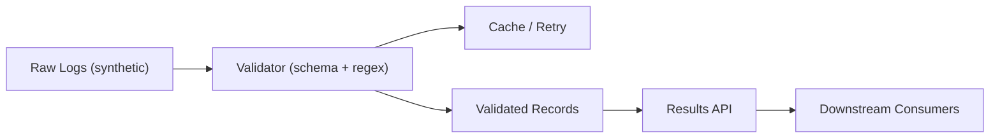

# Compliance-Analysis-of-Corporate-Social-Responsibility-Reports

**Role:** NLP/ML Engineer (Student Research Project)
**When:** July 2023 – June 2024 · **Original Repo:[https://github.com/csrone-dev]**

> **Disclaimer:** This portfolio uses sanitized descriptions and **synthetic examples only**. No proprietary code, data, screenshots, internal IDs, or configurations from ASML are included.

---

## Problem
CSR reports are lengthy and inconsistent. Each year-end, when CSRone (a government-affiliated body) evaluates whether companies have disclosed or met environmental indicators, reviewers must read the reports manually. However, this approach is time-consuming, labor-intensive, costly, and prone to inconsistent judgments across reviewers.

## P1 — Retrieval-Augmented Generation (RAG) Pipeline for Environmental Risk Indicators Checks
**Solution:** Developed a **retrieval-augmented generation (RAG)** pipeline for environmental risk indicators checks with **definition-augmented prompts**.

**Highlights:**
- **PDF cleanup & chunking.** Strip noisy front-matter (first-five-pages detection), then split reports into ~300-char overlapping chunks and embed them into a local **ChromaDB** index (e.g., `moka-ai/m3e-base`). :contentReference[oaicite:0]{index=0}
- **Definition-aware retrieval.** For each risk, retrieve top chunks using a query formed as “{risk_name} is defined as {definition}”, with percentile cutoffs (e.g., 98th) to keep only highly similar passages. :contentReference[oaicite:1]{index=1}
- **LLM judgment with prompt families.** Run **four** prompt strategies—zero-shot, zero-shot-CoT, few-shot, few-shot-CoT—over retrieved chunks, using **multi-thread** execution to speed batch scoring; export multiple CSV views for downstream review. :contentReference[oaicite:2]{index=2}
- **Few-shot example tooling.** Auto-generate/bold risk keywords, back-fill ~300-char context chunks, and write short reasoning notes to improve few-shot exemplars. :contentReference[oaicite:3]{index=3}
- **Reviewer UX helpers.** A small Apps Script transforms `**bold**` markup in Google Sheets into styled text for clearer human annotation passes. :contentReference[oaicite:4]{index=4}
- **Label alignment & metrics.** Map model outputs to human labels, then compute per-company TP/FP/FN_partial/TN_partial and **Precision / Relative-Recall / Relative-F1**; also support **micro** (pooled) metrics across companies. :contentReference[oaicite:5]{index=5}
- **Post-hoc analysis.** Merge results across companies; report per-risk metrics, visualize **CoT deltas** (ΔPrecision/Recall/F1), build **ensemble (majority-vote)** predictions, heatmaps by risk × prompt, and **Jaccard** overlap across prompt families. :contentReference[oaicite:6]{index=6}
- **Runbook & env.** One-command installs and `.env` with `OPENAI_API_KEY` for reproducible local runs. :contentReference[oaicite:7]{index=7}

**Impact:**
- Raised zero-shot accuracy from 52% to 72%
- Deployed across more than 80 companies, and decreased manual review time and costs by 70%.

**Pipeline (simplified)**

---

## P2 — Robot Framework API Test Suites & CI Quality Gates

## Results (on synthetic setup mirroring real patterns)
- Accuracy lifted from **~52% → ~72%** on indicator checks; improved citation quality and consistency.

## Stack
**Python**, **PyTorch/HF**, **BM25/FAISS**, **scikit-learn**, **pandas**, **spaCy**, **Mermaid**

## Repo map
