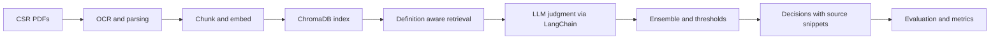
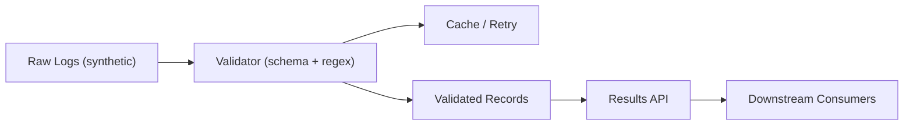

# Compliance-Analysis-of-Corporate-Social-Responsibility-Reports

**Role:** NLP/ML Engineer (Student Research Project)
**When:** July 2023 – June 2024 · **Original Repo:[https://github.com/csrone-dev]**

> **Disclaimer:** This portfolio uses sanitized descriptions and **synthetic examples only**. No proprietary code, data, screenshots, internal IDs, or configurations from ASML are included.

---

## Problem
CSR reports are lengthy and inconsistent. Each year-end, when CSRone (a government-affiliated body) evaluates whether companies have disclosed or met environmental indicators, reviewers must read the reports manually. However, this approach is time-consuming, labor-intensive, costly, and prone to inconsistent judgments across reviewers.

## P1 — Retrieval-Augmented Generation (RAG) Pipeline for Environmental Risk Indicators Checks
**Solution:** Developed a **retrieval-augmented generation (RAG)** pipeline for environmental risk indicators checks with **definition-augmented prompts**.

**Highlights:**
- Ingestion: PDF parsing plus OCR for scans; text normalization.
- Chunking & Index: Overlapping chunks → embeddings → **ChromaDB** vector store.
- Retrieval: Definition-aware queries per indicator → top-k similarity search.
- LLM Judgment: Zero-shot, few-shot, and CoT prompts orchestrated via **LangChain**; simple ensemble voting.
- Supervised Model: Per-indicator **Chinese RoBERTa** fine-tuning with **Hugging Face + PyTorch**; class weighting, minority upsampling, and calibrated thresholds.
- KPI Extraction: OCR + regex rules for environmental KPIs; unit normalization with source snippets.
- Orchestration: Batch runners and **LangChain** chains; multi-thread execution; CSV exports.
- Evaluation: Per-indicator and pooled-micro **Precision/Recall/F1**; basic error taxonomy.
- Ops: `.env` config and single-command runs for reproducible local setup.

**Impact:**
- Raised zero-shot accuracy from 52% to 72%
- Deployed across more than 80 companies, and decreased manual review time and costs by 70%.

**Pipeline (simplified)**

---

## P2 — Retrieval-Augmented Generation (RAG) Pipeline for Environmental Risk Indicators Checks
**Solution:** Developed a **retrieval-augmented generation (RAG)** pipeline for environmental risk indicators checks with **definition-augmented prompts**.

Fine-tuned per-indicator Chinese RoBERTa; handled 5% positive-class skew via class weighting, minority upsampling, and calibrated thresholds.

**Highlights:**
- Ingestion: PDF parsing plus OCR for scans; text normalization.
- Chunking & Index: Overlapping chunks → embeddings → **ChromaDB** vector store.
- Retrieval: Definition-aware queries per indicator → top-k similarity search.
- LLM Judgment: Zero-shot, few-shot, and CoT prompts orchestrated via **LangChain**; simple ensemble voting.
- Supervised Model: Per-indicator **Chinese RoBERTa** fine-tuning with **Hugging Face + PyTorch**; class weighting, minority upsampling, and calibrated thresholds.
- KPI Extraction: OCR + regex rules for environmental KPIs; unit normalization with source snippets.
- Orchestration: Batch runners and **LangChain** chains; multi-thread execution; CSV exports.
- Evaluation: Per-indicator and pooled-micro **Precision/Recall/F1**; basic error taxonomy.
- Ops: `.env` config and single-command runs for reproducible local setup.

**Impact:**
- Raised zero-shot accuracy from 52% to 72%
- Deployed across more than 80 companies, and decreased manual review time and costs by 70%.

**Pipeline (simplified)**

