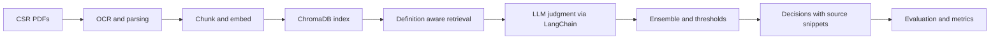
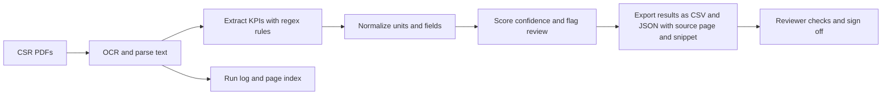

# Compliance-Analysis-of-Corporate-Social-Responsibility-Reports

**Role:** NLP/ML Engineer (Student Research Project)
**When:** July 2023 – June 2024 · **Original Repo:[https://github.com/csrone-dev]**

> **Disclaimer:** This portfolio uses sanitized descriptions and **synthetic examples only**. No proprietary code, data, screenshots, internal IDs, or configurations from ASML are included.

---

## Problem
CSR reports are lengthy and inconsistent. Each year-end, when CSRone (a government-affiliated body) evaluates whether companies have disclosed or met environmental indicators, reviewers must read the reports manually. However, this approach is time-consuming, labor-intensive, costly, and prone to inconsistent judgments across reviewers.

## P1 — Retrieval-Augmented Generation (RAG) Pipeline for Environmental Risk Indicators Checks
**Solution:** Developed a **retrieval-augmented generation (RAG)** pipeline for environmental risk indicators checks with **definition-augmented prompts**.

**Highlights:**
- **Ingestion:** Parse PDFs and run OCR for scans, then clean and normalize the text.
- **Chunking & Index:** Split text into overlapping chunks, create embeddings, and store them in **ChromaDB** for fast similarity search.
- **Retrieval:** For each indicator, form a definition-aware query and fetch the top-k relevant chunks.
- **LLM Judgment:** Use **LangChain** to run zero-shot, few-shot, and chain-of-thought prompts over retrieved context, then ensemble the results.
- **Supervised Model:** Fine-tune **Chinese RoBERTa** per indicator with **Hugging Face + PyTorch**; handle class imbalance with weights and light upsampling; calibrate probabilities and thresholds.
- **KPI Extraction:** Use OCR and regex to pull environmental KPIs, normalize units, and attach source snippets for auditability.
- **Orchestration:** Provide batch runners and **LangChain** chains with multi-thread execution and CSV exports for reviewers.
- **Evaluation:** Report per-indicator and pooled (micro) **Precision/Recall/F1**, plus a simple error taxonomy to diagnose misses.
- **Ops:** Use a `.env` config and one-command scripts for reproducible setup and runs.

**Impact:**
- **Accuracy:** Raised zero-shot accuracy from 52% to 72%
- **Availability:** Deployed across more than 80 companies, and decreased manual review time and costs by 70%.

**Pipeline (simplified)**

---

## P2 — Fine-tuned per-indicator Chinese RoBERTa for RAG Pipeline's supervised model 
**Solution:** Fine-tuned a Chinese RoBERTa classifier per indicator, addressing ~5% positive-class skew with **class weighting** and **minority upsampling**, then **calibrated probabilities** and **per-indicator thresholds** to serve as the **supervised judgment stage** in the RAG pipeline.

**Highlights:**
- **Data:** Built per-indicator datasets, balanced positives and negatives, removed duplicates, split by company to avoid leakage, and tokenized with Hugging Face.
- **Training:** Fine-tuned Chinese RoBERTa with **Hugging Face** and **PyTorch** using **class weights** and **light upsampling**, with **early stopping** and **mixed precision** for speed.
- **Calibration:** Calibrated **predicted probabilities** and tuned a **per-indicator threshold** to meet target precision/recall.
- **Evaluation:** Reported **Precision, Recall, F1, and PR/ROC AUC** with simple confusion tables to spot common errors.
- **Serving:** Provided a small **CPU-friendly batch-scoring script** that outputs JSON/CSV and plugs into the RAG pipeline.
- **Ops:** Versioned models and configs with fixed seeds and one-command training and evaluation for fully reproducible runs.

**Impact:**
- **Imbalance handled**: Stable performance with ~5% positives via weighting, upsampling, and calibration.
- **Quality improved**: Higher pooled F1 and better recall at fixed precision versus zero-shot prompts alone.
- **Operational**: Reliable, CPU-friendly batch scoring and clear per-indicator thresholds reduced false positives and reviewer rework.

**Pipeline (simplified)**

---

## P3 — One-click Tool for Environmental KPI Checks
**Solution:** Built a one-click OCR and regex tool that extracts environmental KPIs from CSR PDFs, normalizes units, and exports source-cited results for quick review.

**Highlights:**
- **Ingestion:** Accepts CSR PDFs, runs OCR for scanned pages, and cleans text for consistent parsing.
- **Rules:** Applies **curated regex patterns** per KPI with small context windows to reduce false positives.
- **Normalization:** Converts units into a standard schema and handles number formats.
- **Confidence:** Scores each match and flags low-confidence results for human review.
- **Output:** Writes a tidy CSV and JSON with KPI, value, unit, year, and source page and snippet for auditability.
- **UX:** Provides a simple **one-click and CLI runner** with **batch processing** for multiple reports.
- **Logging:** Saves a run log and page locations to make reviews and rechecks traceable.

**Impact:**
- **Accuracy:** ~94% on held-out KPI checks; substantially faster reviewer triage and handoff.
- **Convenience:** One-click runner for non-technical users; CPU-friendly and no coding required.
- **Throughput:** Batch processing across multiple reports per run with automated extraction and export.
- **Auditability:** Every record includes source page and snippet, enabling quick spot-checks and sign-off.

**Pipeline (simplified)**

